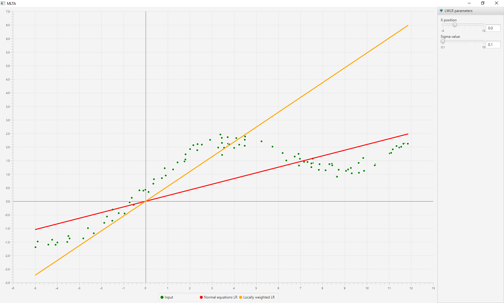
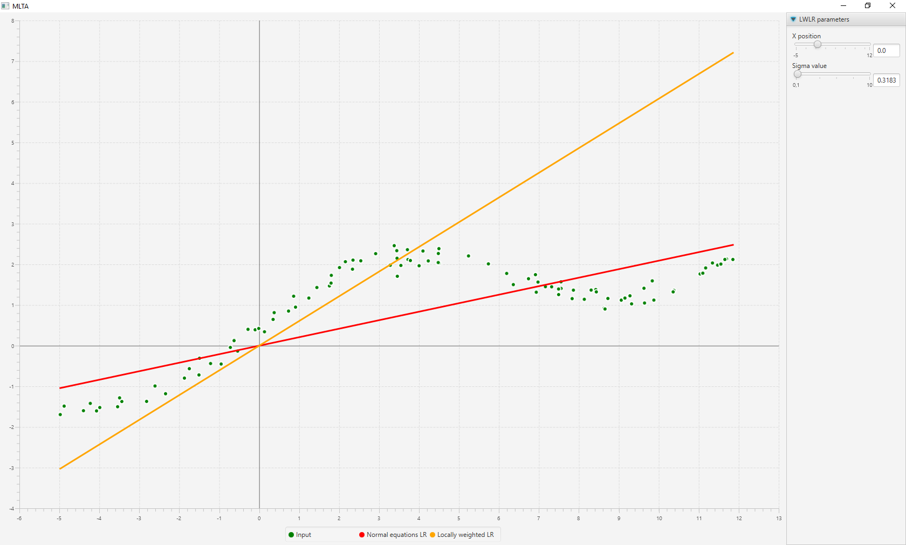
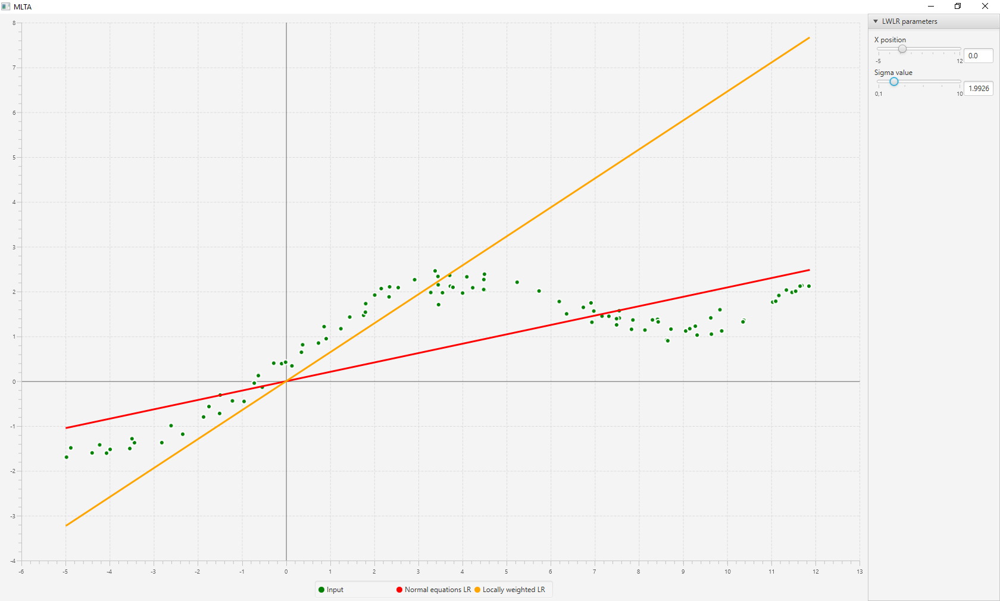
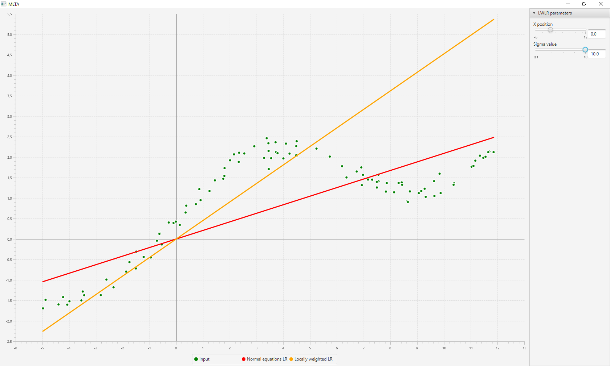

# Machine learning - Theory and algorithms (MLTA)

Project made for MLTA lecture for ED-SPIM at the Université de Technologie de Belfort-Montbéliard (UTBM)

## Project purpose

The purpose of the project is to illustrate two linear regression methods frequently used in machine learning algorithms:
* Linear regression using normal equations
* Locally weighted linear regression (LWLR)

## Compilation

The project is made in Java 8. It can be built easily with Maven using the command:

```
mvn jfx:native
```

## Results

Following figures illustrate the results of application of the linear regression algorithms on Leland dataset
(located here in src/main/resources).

The red line shows the results of applying normal equations method. The orange one shows the result of applying LWLR.
LWLR takes two parameters x (central value for weights) and sigma (a factor adjusting the weights for values according
to their distance from x: if sigma is small, weight decrease really quickly with distance to x, if sigma is big,
weight decrease slowly with distance to x).


Fig.1 - X = 0, sigma = 0.1


Fig.2 - X = 0, sigma = 0.3


Fig.3 - X = 0, sigma = 2


Fig.4 - X = 0, sigma = 10

On these figures, we can see that as sigma increases, the orange line (the LWLR) coefficient decreases. It is due to the
fact that the rightest points weights (far from x = 0) are increasing as sigma is increasing, and thus are more taken
into account by the linear regression, so the orange line lean toward these points.